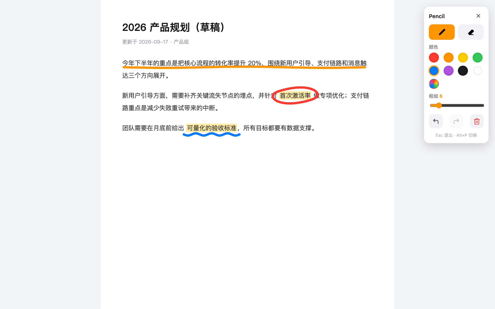

# Pencil 网页涂鸦

一个用于在任意网页上涂鸦标注的 Chrome 扩展。画笔、橡皮擦、颜色、粗细、清空、撤销重做，涂鸦锚定在绘制处的内容上，整页滚动或内嵌滚动容器（如聊天消息列表）滚动时都跟随移动。



## 功能

- **画笔**：自由绘制，二次贝塞尔平滑，点按留下圆点
- **橡皮擦**：擦除涂鸦内容，光标是与擦除范围等大的白色方块，便于对准
- **鼠标模式**：工具栏切到鼠标后覆盖层不拦截指针，可正常点击、滚动、悬停页面（涂鸦保留在屏幕上），随时切回画笔继续画
- **颜色**：8 个预设色块，外加取色器自定义颜色
- **粗细**：1–40px 滑块调节
- **记住设置**：颜色与粗细自动保存（仅存本地），下次打开保持上次的选择
- **清空**：一键清空全部涂鸦（可撤销）
- **撤销 / 重做**：按钮或 `Ctrl/Cmd+Z`、`Ctrl/Cmd+Shift+Z`
- **滚动跟随**：涂鸦在绘制处锚定（起点落在内嵌滚动容器内则锚定容器内容，否则锚定页面文档），整页滚动与容器内部滚动都跟随内容移动，滚出容器（或任一外层裁剪容器）可见范围的部分自动隐藏；重绘时按包围盒剔除视口外的笔画
- **高分屏清晰**：按 `devicePixelRatio` 渲染，Retina 屏不模糊；窗口缩放后涂鸦位置不变
- **无侵入**：覆盖层与工具栏挂在 Shadow DOM 中，样式与页面完全隔离；仅在需要时注入

## 安装

1. 克隆或下载本项目
2. 打开 `chrome://extensions/`，右上角开启「开发者模式」
3. 点击「加载已解压的扩展程序」，选择本项目目录
4. 在任意网页按 `Alt+P` 或点击工具栏上的 Pencil 图标开启涂鸦

## 使用

- `Alt+P` 或点击扩展图标：开启 / 关闭涂鸦模式
- 在页面上按住拖动：绘制；工具栏切换 画笔 / 橡皮擦 / 鼠标（鼠标模式下正常操作页面），点色块换颜色，拖滑块改粗细
- 清空按钮：清空全部，可用撤销恢复
- `Esc`：退出涂鸦模式（涂鸦保留，再次开启可继续）
- 工具栏顶部可拖动移动位置，右上角 × 关闭

## 项目结构

```
manifest.json   扩展清单（Manifest V3）
background.js   点击图标时按需注入内容脚本并切换涂鸦模式
content.js      涂鸦层与工具栏的全部实现
icons/          扩展图标
docs/           README 截图
```

## 实现要点

- Manifest V3，`activeTab` + `scripting` 按需注入，不常驻页面
- 每笔记录为锚定坐标下的点序列 `{ tool, color, width, points, bbox, anchor }`：绘制起点落在可滚动容器内时 `anchor` 为该容器、点坐标记在容器内容坐标系，否则 `anchor` 为 null、点坐标记在页面文档坐标系；渲染时由 `anchor.getBoundingClientRect()` 与容器滚动量推出 `setTransform` 偏移，因此整页滚动、内嵌容器滚动（含容器被带动）都跟随，并用 `ctx.clip()` 把笔画裁剪到容器的可见内容窗口（由 `scrollLeft/scrollTop` 与 `clientWidth/clientHeight` 推出），再与所有会裁剪内容的祖先容器（`overflow` 非 `visible`）的可见窗口求交，滚出任一层窗口的部分都不显示
- 撤销 / 重做基于笔画列表的版本引用，内存开销小（上限 300 步）
- 颜色与粗细偏好存入 `chrome.storage.local`（防抖写入，仅本地不联网），内容脚本初始化时恢复
- 橡皮擦通过 `destination-out` 合成实现，重绘时按笔画顺序回放，与实时绘制结果一致

## 已知限制

- 涂鸦在绘制起点处锚定到最近的可滚动容器。若容器内容被重建（例如聊天的虚拟列表回收 DOM 节点）、或容器在绘制后被移除，锚定会失效，涂鸦位置可能出现偏移；横跨容器边界的笔画整笔按起点锚定，超出容器可见范围的部分会被裁剪隐藏
- 仅支持在 http/https 页面涂鸦（`chrome://` 等浏览器内置页面不允许注入）
